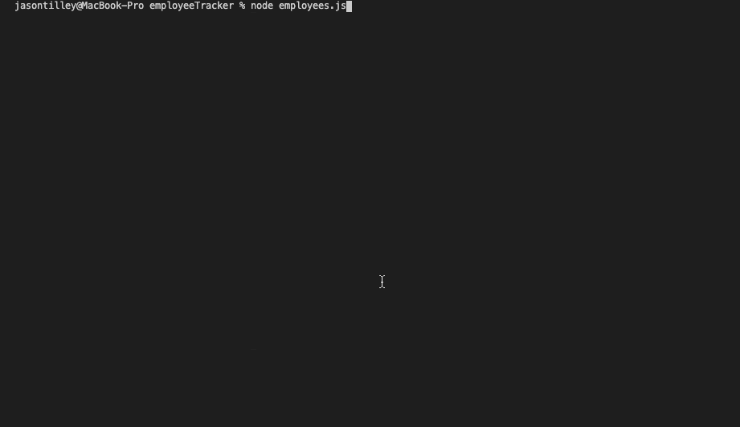

# Employee Tracker


## Description
This is a CRUD app for employers to keep track of employees. It uses inquirer to get the data for the different functionalities.

## Link
Repo link: https://github.com/mmcginley32/employeeTracker

## Author
Mason McGinley

## Tech Used
JavaScript, jQuery, ES6, Node.js, inquirer, mysql, console.table

## Table of Contents
  * [Example](#example)
  
  * [Installation](#installation)
  
  * [Usage](#usage)
  
  * [License](#license)
  
  * [Tests](#tests)
  

## Example
  


## Installation
To install the necessary denpendencies, run the following command:
```
npm i
```

## Usage
* Fork it
* Clone it to your computer
* run "node employee.js" in the terminal

## License
The license for this project is: *MIT* ©  2020 Mason McGinley
  

## Tests
* create the database and tables from the schema.sql file and start
* run the app in the terminal and start filling in data.


  